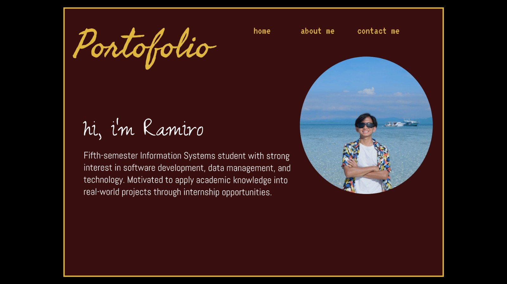
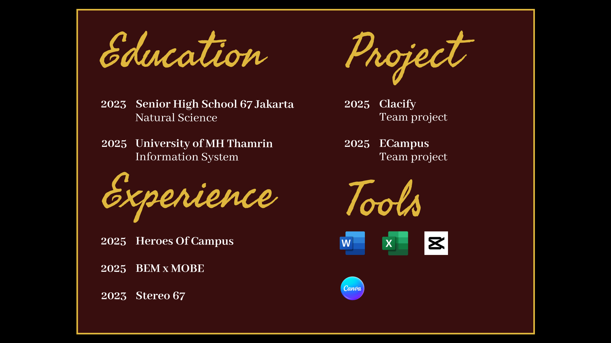
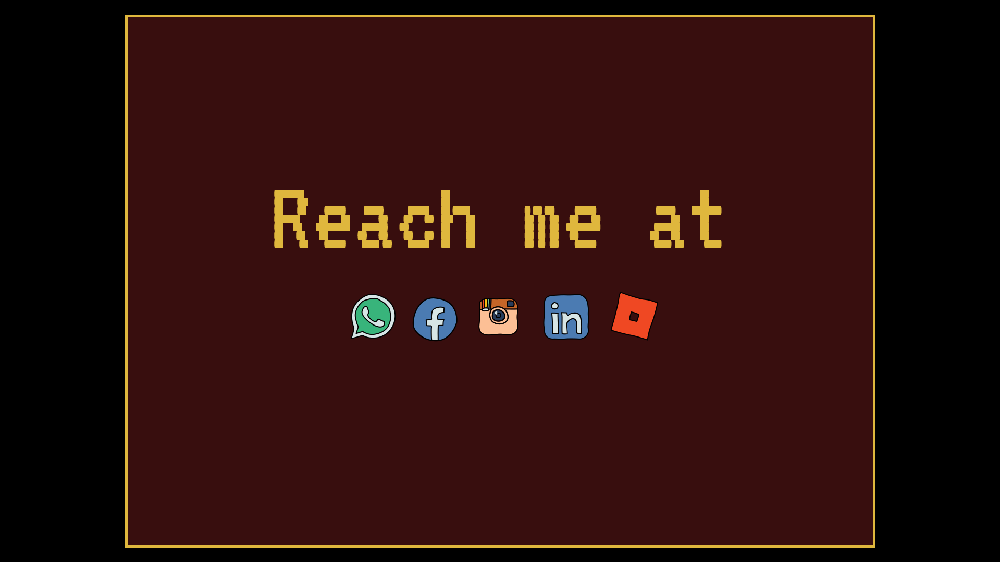

# 💡Personal Website

This is my personal website where I showcase my portfolio and blog about web development.
My goal is to keep learning, building, and connecting with others who share the same enthusiasm for technology and innovation.

## 🔗 Links

- [My Portfolio](https://myportfolio.com)
- [UI/UX Design Resources](https://www.figma.com/proto/Dd8p7G37TJH981DMpL2Vft/PROJECT-PORTOFOLIO---RAMIRO-CY?node-id=2-2&p=f&t=AQjZ8jjvLuhiVPpH-1&scaling=min-zoom&content-scaling=fixed&page-id=0%3A1)

## 📱 Social Media

- [GitHub](https://github.com)
- [LinkedIn](https://linkedin.com)
- [Instagram](https://www.instagram.com/ramcyy_?igsh=N2FiM3U2Znk2NDF1&utm_source=qr)

## 📖 Pages

- Home
- About ME
- Contact

## 🏠Home

Welcome to my personal website! I’m passionate about creating clean, responsive, and modern websites that deliver great user experiences.
Here, you can explore my portfolio, read my thoughts on web development, and see what I’ve been working on lately!

## 👨‍💻 About me

Hi! I’m Ramiro --an Information Systems student with a strong interest in web development and digital design. I enjoy turning complex problems into simple, beautiful, and intuitive solutions. My focus is on building creative projects using technologies like HTML, CSS, JavaScript, and modern frameworks. Also, I like learning about UI/UX trends and exploring new tools that make development more efficient.

## 📞 Contact

Let’s get in touch! I’m always open to collaboration, internships, or just a friendly chat about web development.

- 📧 Email: [ramirocahyoyusan@gmail.com]
- 💼 LinkedIn: [www.linkedin.com/in/ramirocy]
- 📸 Instagram: [https://www.instagram.com/ramcyy_]

## 🔧Technologies Used

- HTML
- CSS
- JavaScript

## Preview

### Home Page

### About Me

### Contact ME

